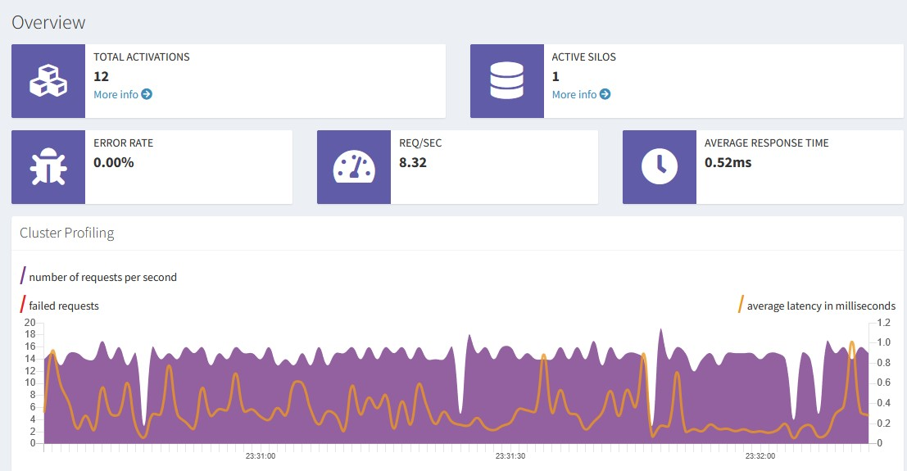
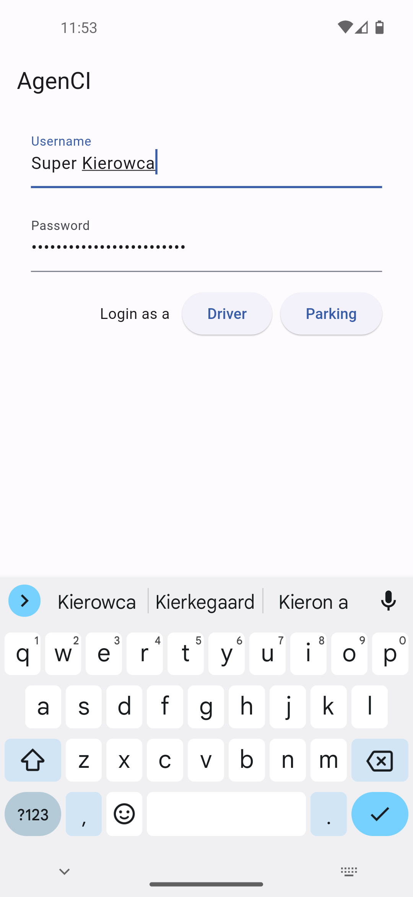
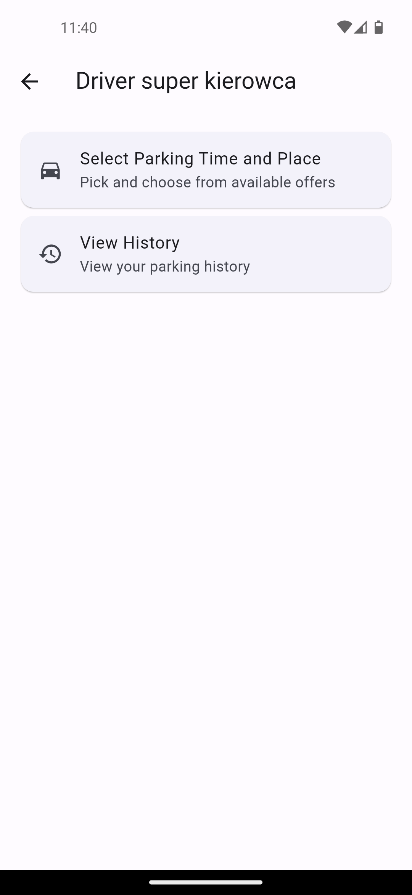
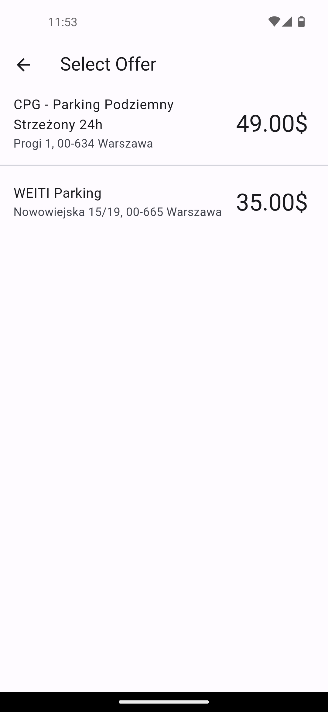
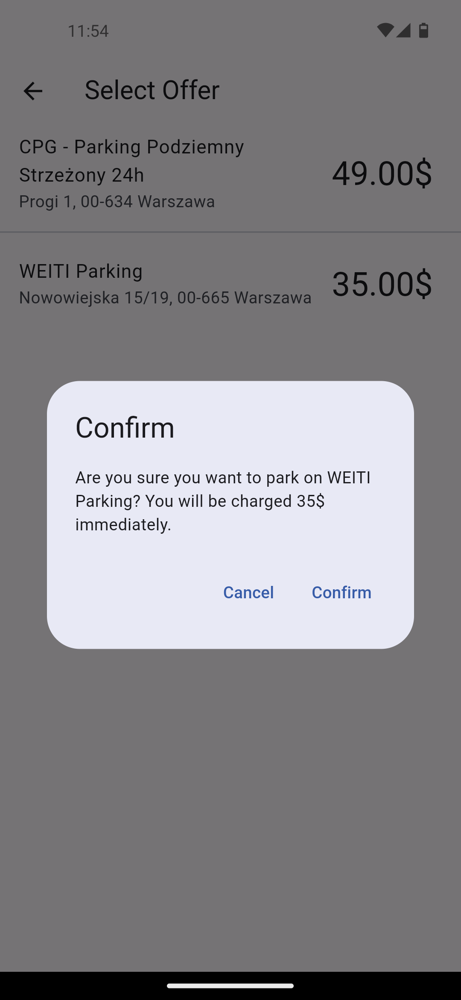
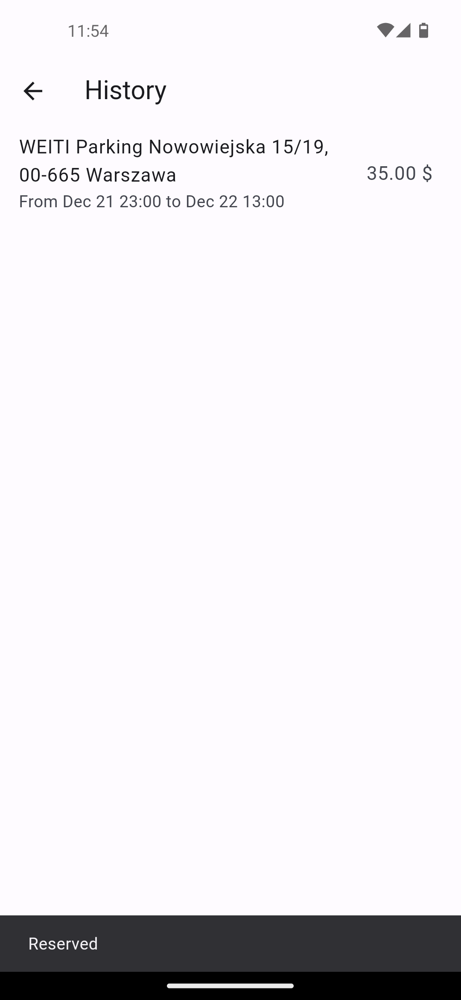
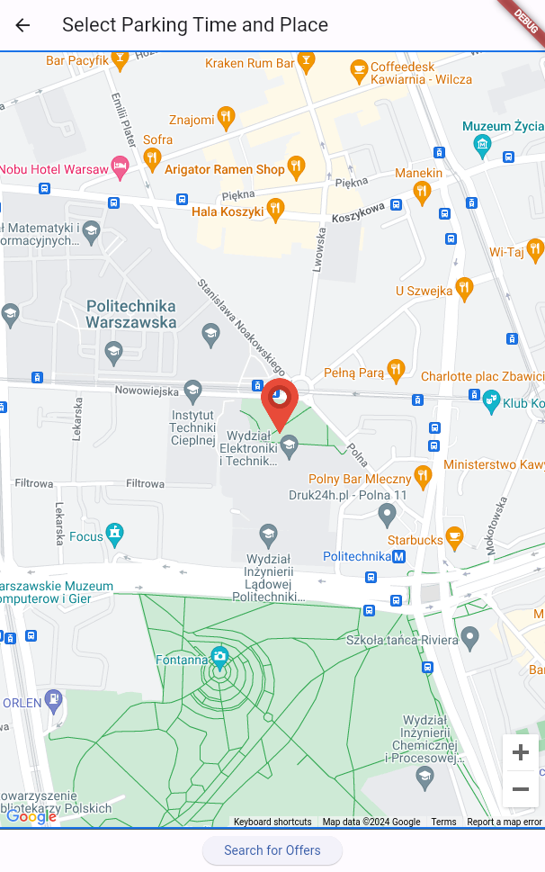

# agenCI

Parking reservation system build with Microsoft Orleans virtual actor framework and Flutter.

## Documentation

Full documentation is located in the `docs` directory. It contains detailed information about the system architecture, design, implementation and deployment. You can view it directly [here](docs/agenCI.pdf).

## Backend

Backend is build with Microsoft Orleans virtual actor framework and C#. It is a distributed system that can be run on multiple nodes.
By default it is configured to run on a single node with `LocalhostClustering`, but it can be easily configured to run on multiple nodes. It provides a REST API through ASP.NET Core for the mobile app to communicate with.

## Mobile app

Mobile app is build with Flutter and Dart. It is a cross-platform app that can be run on both Android and iOS.
Code for the mobile app is located in the `front` directory.

    
     
    
    
    

